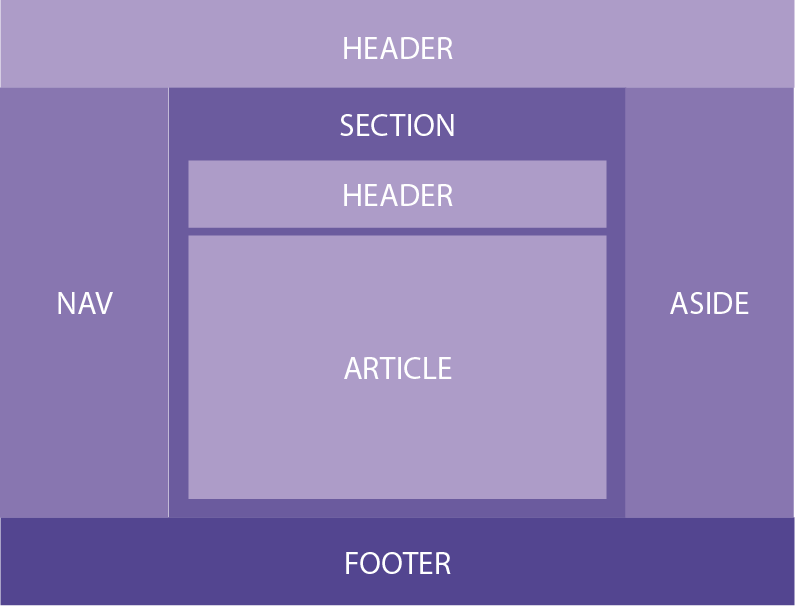

## 개요

SEO (검색엔진 최적화 : Search Engine Optimization) 같은 마케팅 도구를 사용하여 검색엔진이 본인의 웹사이트를 검색하기 알맞은 구조로 웹사이트를 조정하기도 하는데 이것은 기본적으로 검색엔진이 웹사이트 정보를 어떻게 수집하는지 아는 것으로 부터 시작된다.

## 시맨틱 웹

검색엔진은 로봇 이라는 프로그램을 이용해 매일 전세계의 웹사이트 정보를 수집한다. 이것을 크롤링이라 하며 검색엔진의 크롤러가 이를 수행한다.

그리고 검색 사이트 이용자가 검색할 만한 키워드를 미리 예상하여 검색 키워드에 대응하는 인덱스를 만들어 둔다. (이것을 인덱싱이라 하며 검색엔진의 인덱서가 이를 수행한다.)

인덱스를 생성할 때 사용되는 정보는 검색 로봇이 수집한 정보인데 결국 웹사이트의 HTML 코드이다. 즉 검색엔진은 HTML코드 만으로 그 의미를 인지하여야 하는데 이때 시멘틱 요소(Semantic element)를 해석하게 된다.

HTML만으로 작성된 문서는 컴퓨터가 해석할 수 있는 메타데이터와 사람이 사용하는 자연어 문장이 뒤섞여 있다. 아래 코드를 보면 1행과 2행은 브라우저에서 동일한 외형을 갖는다. 이는 h1 태그의 스타일이 1행과 같기 때문이다.

```html
<font size="6"><b>Hello</b></font>
<h1>Hello</h1>
```

그러나 1행의 요소는 어떤 의미도 가지고 있지 않다.

즉 의도가 명확하지 않다. 개발자가 의도한 요소의 의미를 명확하게 나타내지 않고 다만 폰트 크기와 볼드체를 지정하는 메타데이터만을 브라우저에게 알리고있다.

그러나 2행의 요소는 header중 가장 상위 레벨이라는 의미를 내포하고 있어서 개발자가 의도한 요소의 의미가 명확히 드러나고 있다. 이것은 코드의 가독성을 높이고 유지보수를 쉽게한다.

검색엔진은 대체로 h1 요소 내의 콘텐츠를 웹문서의 중요한 제목으로 인식하고 인덱스에 포함시킬 확률이 높다.

또한 사람도 h1 요소 내의 콘텐츠가 제목임을 인식할 수 있다. 시맨틱 요소로 구성되어 있는 웹페이지는 검색엔진에 보다 의미론적으로 문서 정보를 전달할 수 있고 검색엔진 또한 시맨틱 요소를 이용하여 보다 효과적인 크롤링과 인덱싱이 가능해졌다. 즉, **시맨틱 태그란 브라우저, 검색엔진, 개발자 모두에게 콘텐츠의 의미를 명확히 설명하는 역할을 한다.** 시맨틱 태그에 의해 컴퓨터가 HTML 요소의 의미를 보다 명확히 해석하고 그 데이터를 활용할 수 있는 시맨틱 웹이 실현될 수 있다.

**시맨틱 웹이란 웹에 존재하는 수많은 웹페이지들에 메타데이터(Metadata)를 부여하여, 기존의 잡다한 데이터 집합이었던 웹페이지를 ‘의미’와 ‘관련성’을 가지는 거대한 데이터베이스로 구축하고자 하는 발상이다.**

HTML 요소는 non-semantic 요소, semantic 요소로 구분할 수 있다.

**non-semantic 요소** div, span 등이 있으며 이들 태그는 content에 대하여 어떤 설명도 하지 않는다.

**semantic 요소**form, table, img 등이 있으며 이들 태그는 content의 의미를 명확히 설명한다,



## 종류

---

| tag        | Description                                                                                                                |
| ---------- | -------------------------------------------------------------------------------------------------------------------------- |
| header     | 헤더를 의미한다                                                                                                            |
| nav        | 내비게이션을 의미한다                                                                                                      |
| aside      | 사이드에 위치하는 공간을 의미한다                                                                                          |
| section    | 본문의 여러 내용(article)을 포함하는 공간을 의미한다                                                                       |
| article    | 분문의 주내용이 들어가는 공간을 의미한다                                                                                   |
| footer     | 푸터를 의미한다                                                                                                            |
| address    | 콘텐츠 작성자나 사이트 소유자의 정보등을 부가적으로 담는 기능                                                              |
| hgroup     | 제목과 관련된 부제목을 묶는 태그                                                                                           |
| main       | 중심 주제, 또는 응용 프로그램의 중심 기능과 직접 관련된 콘텐츠를 나타낸다.                                                 |
| details    | 주변 문맥에서 표시된 구절의 관련성 또는 중요성으로 인해 참조 또는 표기 목적으로 표시되거나 강조된 텍스트를 나타냅니다.     |
| figure     | 이미지, 다이어그램, 사진 등 독립적인 컨튼츠 정의시 사용                                                                    |
| figcaption | figure 요소의 설명 캔션(caption) 정의                                                                                      |
| mark       | 현재 맥락에 관련이 깊거나 중요한 부분 강조                                                                                 |
| time       | 시간의 특정 지점 또는 구간, datetime과 같은 속성을 이용해 알림같은 기능 구현                                               |
| summary    | details 요소에 대한 요약, 캡션 또는 범례를 지정합니다. summary 요소를 클릭하면 상위 details 요소의 상태가 열리고 닫힙니다. |
