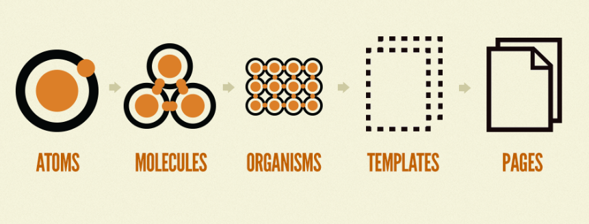

## 1. Atomic Design이란?

웹 프론트 개발 프레임워크 라이브러리인 Angular,Vue,React는 컴포넌트 단위로 개발을 진행한다.

이러한 **컴포넌트를 가장 작은 단위로 설정**하고 이를 바탕으로 **상위 컴포넌트를 만들어 코드 재사용을 최대화하는 방법론이다**. 따라서 아토믹 디자인이 **컴포넌트 중심 설계 패턴에서 더욱 주목**받게 되었다.

아토믹 디자인은 **원자(Atoms)**,**분자(Molecules)**,**유기체(Organisms)**,**템플릿(Templates)**,페이지(Pages)로 효과적인 인터페이스 시스템을 만든다.

> **디자인 시스템과 아토믹 디자인**
> bred frost의 아토믹 디자인은 화학적 관점에서 영감을 얻은 디자인 시스템이다. 모든것은 원자로 구성되어있고 원자들이 서로 결합해서 분자가 되고, 분자는 더 복잡한 유기체로 결합하여 궁극적으로 모든 물질을 생성한다. 아토믹 디자인에서는 이 개념을 차용해서 컴포넌트를 atom,molecules,organisms,templates,pages의 **5가지 레벨로 나눈다.**

아토믹 디자인은 당음과 같이 단계별 기준을 가지고 있다. 단계별로 추상적인 것에서 구체화 하는 단계를 가진다. 이 과정을 통해 일관성을 가지고 확장하면서 최종 콘텐츠를 보여줄 수 있다.



**Atoms(원자)**

- **가장 작은 단위의 컴포넌트**이다. (디자인과 기능의 최소 단위)
- 다양한 state 즉 상태, 색상, 폰트, 애니메이션과 같은 **추상적인 요소가 포함될 수 있다.**
- 대표적인 컴포넌트는 **버튼(Button)**, **텍스트(Text)**, **아이콘(Icon)** 등이 있다.

**Molecules(분자)**

- **2개 이상의 원자로 구성**되어 있다.
- 하나의 단위로 함께 동작하는 **UI컴포넌트들의 단순한 그룹**이다.
- 대표적인 컴포넌트는 입력 **폼(Input Form)**,**Navigation, Card** 등이 있다.

**Organism(유기체)**

- **분자들을 결합하여 유기체를 형성** (분자가 되지 않은 원자도 포함)
- **인터페이스가 어떻게 보이는지 시작**하는 단계
- 대표적인 컴포넌트는 **입력 폼과 함께 헤더를 감싸거나, 카드를 관리하는 그리드 등**이 있다.

**Templetes(템플릿)**

- 여러 유기체의 집합
- 디자인을 확인하고 레이아웃이 실제로 구동하는지 확인하는 단계
- 대표적인 컴포넌트는 여러 카드와 그리드를 묶는 템플릿 Header, Footer, Main 등이 있다.

**Page(페이지)**

- 템플릿을 이용해서 **배치를 통해 컴포넌트를 그려서 디스플레이한다.**
- **완성된 하나의 페이지**이다.

## 2. Atomic Design의 장단점

### 2-1. 장점

- 디자인 시스템 구성에 있어서 **가이드라인으로 활용할 수 있다.**
- **애플리케이션과 분리**하여 **컴포넌트를 개발하고 테스트할 수 있고**, **스타일 가이드와 같은 도구에서 볼 수 있다.**
- 컴포넌트 **재사용성이 극대화한다.**

### 2-2. 단점

- **의존성과 복잡도가 까다롭다.**
  - ex) A에서 사용하는 헤더에서 변경 사항이 필요할 때.
  1. 헤더 컴포넌트에서 props를 추가해서 변경 사항을 적용하게 한다.
  2. 새로운 헤더 컴포넌트를 만든다.
- 1번으로 해결할 경우 **어디까지 props로 지정해야 할지 모호하다.**
- 2번으로 해결할 경우 **컴포넌트가 무한 증식될 수 있고**, **재사용성이 떨어지고, 어떤 기능을 하는지 명확히 구분하기 어려워 진다**.

## 3. 아토믹 디자인 방법론 이외에 할 수 있는 것들

### 3-1. 컴포넌트를 제어하는 것들은 아토믹 컴포넌트 외부에서 주입

웹에서 컴포넌트 작업시 스토리북을 적극적으로 활용하고 있다. **컴포넌트를 제어할 수 있는 UI상태나 동작에 대한 이벤트 핸들러를 외부에서 처리할 수 있도록 props로 다룬다.** 스토리북에서 컴포넌트의 상태와 동작을 한눈에 확인할 수 있고 **유연성과 재사용성이 높아지는 장점**이 있다.

### 3-2. UI 모델링

디자인된 페이지를 **담당 개발자들과 함께 아토믹 컴포넌트 단위와 네이밍을 작성한다.** 회사 사이트 웹 에서는 **figma를 이용하며 UI 모델링을 진행**한다. 이작업을 같이 하게되면 **논의를 통해 적절한 단위의 아토믹 컴포넌트를 작성할 수 있다.** 또한 팀원간 아토믹 단위에 대해 주관적인 기준을 점점 맞춰나갈 수 있다. 단 한번의 모델링으로 이상적인 아토믹 디자인 단위를 나눌 수 없다. 컴포넌트를 실제 코드로 작성하며 혹인 다른 페이지에서 비슷한 디자인의 컴포넌트가 추가된다면 얼마든지 변경될 수 있다. **UI 모델링 외에도 지속적인 커뮤니케이션, 긴밀한 피드백**을 통해 이상적인 아토믹 디자인 구조로 나아갈 수 있다.

### 3-2. 레이아웃과 관련된 스타일은 외부에서 주입

**아토믹 디자인 뿐만 아니라 디자인 시스템의 컴포넌트는 재사용 될 수 있다**. 재사용성을 높이기 위해, 마진 패딩등과 같은 스타일은 아토믹 컴포넌트에서 정의하지 않고 **컴포넌트를 사용하면서 주입하도록 한다.** 아래와 같이 가장 바깥쪽 DOM의 attribute를 인터페이스로 확장한다. 이걸을 구조 분해 할당을 이용하여 사용하는 곳에서 레이아웃을 지정할 수 있도록 한다. 이 간단한 규칙을 통해 재사용성을 높일 수 있다.

```jsx
function Comment ({name, children, ...props}) {
	return (
		<div {...props}>
			<Text>{name}</Text>
			<Text>{children}</Text>
		</div>
	)
}

function ProductPage ({
	commentList,
	...
}) {
	return (
		<div>
			...
			{
				commentList.map(comment => (<Comment style={{ margin: '20px 40px', flex: 1}} />))
			}
		</div>
	)
}

function CommentPage({ ... }){
	return (
		<div>
			<Comment style={{ width: '80%', margin : '0 auto' }}
		</div>
	)
}
```
