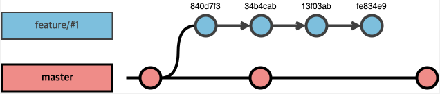

## git cherry-pick?

git을 이용해서 코드를 관리할때 **다른 브랜치에 적용된 커밋을 가져와서 내 브런치에 적용하고 싶은 경우가 있다**.

develop 브랜치에서 기능 개발 브랜치를 따고 작업하다가 develop 브랜치에 새로운 커밋이 추가된 경우라면 rebase 를 사용한다.

그게 아니라면 cherry-pick명령을 사용해서 **다른 브랜치의 커밋을 가져올 수도 있다.** 하지만 **꼭 사용해야만 할 때 진행**하는 것이 좋다.

### git cherry-pick

git cherry-pick 명령이 어떤 것인지 알기 위해서는 git으로 관리되는 커밋들을 그림으로 그려볼 필요가 있다.



두개의 브런치 X,와 Y가 있다고 하자. 현재 Y를 개발하고 있는 상황에서 branch X에 적용되어 있는 3개의 커밋을 가져와서 반영하고싶은 상황이다. 이럴 때 git cherry-pick 명령을 이용하면 된다.

```bash
git cherry-pick <commit hash>
```

이런식으로 cherry-pick 명령 뒤에 커밋 해시 값을 명시해주면 된다. 한번에 여러개의 커밋을 반영하고 싶은 경우

```bash
git cherry-pick 13f03ab 840df3 34b4cab
```

이렇게 여러개를 뒤쪽에 입력해도 되고

```bash
git cherry-pick 13f03ab..84df3
```

이런 식으로 가져오고 싶은 커밋 범위의 첫번째와 마지막 커밋 해시 값을 .. 문자로 이어주면 둘 사이에 있는 모든 커밋들을 가져와서 현재 브랜치에 반영하게 된다. 첫번째 입력한 커밋은 반영이 안되며, 그 다음 커밋부터 마지막 커밋까지 범위가 반영된다.


이런 식으로 다른 브랜치에 적용된 커밋 사항을 현재 브랜치로 가져올 수 있다. 코드에 대한 수정사항은 물론이고 커밋 로그와 작성자 역시 그대로 가져와진다.

### git cherry-pick : -continue 와 -abort 옵션

다른 브랜치의 커밋 사항을 가져오는 동작이다보니 수정 사항이 현재 브랜치의 코드에 맞지 않는 경우가 있따. 이 경우 충돌이 발생하게 된다. rebase나 merge할 때에도 코드 충돌이 발생하는데 cherry-pick에서도 같은 이유로 충돌이 발생할 수 있다.

이 경우 cherry-pick을 포기하거나 충돌 상황을 해결하고 cherry-pick을 진행할 수 있다.

**-abort**

```bash
git cherry-pick -abort
```

만약 cherry-pick을 중단하고 싶으면 -abort 옵션을 이용해서 cherry-pick 을 중단할 수 있다. 이 경우 cherry-pick을 실행하기 전 상황으로 코드가 돌아간다.

**-countinue**

```bash
vi $file_path # 파일 수정
git add $file_path
git cherry-pick -continue
```

충돌이 발생한 코드를 에디터로 열어서 수정한다. 그 다음 git add <file path> 명령으로 수정된 코드를 추가한다. 이후 git cherry-pick -continue 명령을 실행하면 충돌을 수정한 코드가 반영되고, cherry-pick이 재개된다.

**cherry-pick merge**

만약 merge 커밋을 cherry-pick 하고 싶으면 다음 명령어를 실행하면 된다.

```bash
git cherry-pick -m 1 <merge 커밋 해시>
```
