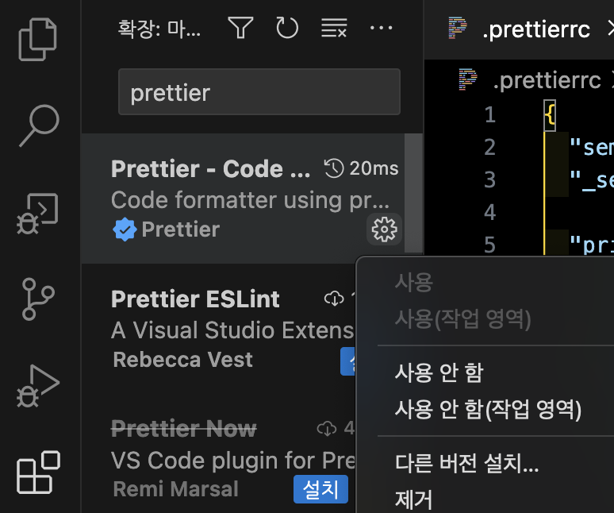
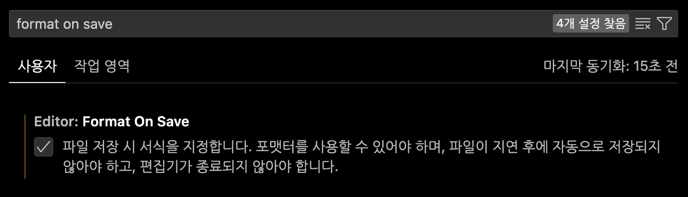
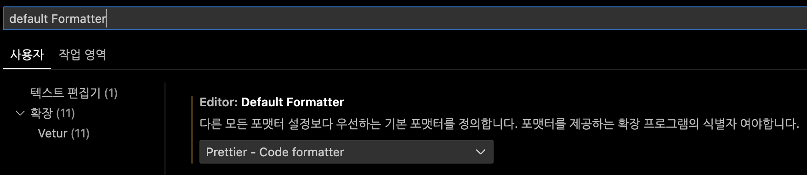

## VSCode -Prettier

visual Studio Code에서 **Prettier**는 **사용자 편의를 위해 코드의 줄 간격이나 행을 자동으로 깔끔하게 정리해주는 확장 프로그램**이다.

## 1. Prettier 확장 다운로드

맥 기준 키보드 단축키 shift + command + X 단축키로 확장탭을 연뒤 prettier를 검색한뒤 설정버튼, 사용을 눌러준다.



설치를 완료하면, 에디터 밑 부분에 Prettier: **✔** 표시가 활성화 된다.


## 2. Prettier 초기 설정

### 2-1. Format on Save 확인

vscode 설정에서 format on save를 입력하고 나오는 설정에 체크되어 있는 지 확인한다.

이 기능은 항상 저장 할때마다, 코드를 포맷팅해 저절로 자동으로 정렬해준다.



### 2-2. Default Formatter 확인

간혹 에디터의 default로 설정되어 있는 formatter가 null 이거나 설정이 잘못되어 있는 경우가 있다.

설정이 prettier - Cose formatter로 설정되어 있는지 확인해야 한다.



## 3. Prettier 주요 설정값 정리

```jsx
{
  "semi": false,
  "_semi": "세미콜론 사용 여부",

  "printWidth": 80,
  "_printWidth": "코드 줄의 최대 길이를 설정함 80~120 주로 사용",

  "tabWidth": 2,
  "_tabWidth": "들여쓰기 크기, 대부분 2를 사용",

  "useTabs": false,
  "_useTabs": "탭 대신 스패이스 사용여부 default = false",

  "singleQuote": false,
  "_singleQuote": "문자열을 작은 따옴표로 표시할지 설정 false는 큰따옴표",

  "trailingComma": "all",
  "_trailingComma": "객체 및 배열 리터럴 끝에 추가 쉼표를 사용할지 여부",

  "bracketSpacing": true,
  "_bracketSpacing": "객체 리터럴의 중괄호 사이에 공백을 추가할지 여부 설정",

  "jsxBracketSameLine": true,
  "_jsxBracketSameLine": "JSX 마지막 > 를 다음 줄로 내릴지 여부",

  "arrowParens": "avoid",
  "_arrowParens": "단독 화살표 함수의 매개 변수 주위에 괄호를 자동으로 붙힘 (default ='avoid')",

  "vueIndentScriptAndStyle": false,
  "_vueIndentScriptAndStyle": "vue 파일의 script와 style태그 들여쓰기 여부",

  "endOfLine": "auto",
  "_endOfLine": "맨 마지막 줄 넣는지 여부",

  "disableLanguages": ["vue"],
  "_disableLanguages": "이 확장 기능을 비활성화 할 언어 ID 목록"
}
```

## 4. Prettier 설정 파일 우선 순위

Prettier의 설정 파일은 아래의 우선순위로 적용이 된다.

1. 먼저 settings.json에 설정한 setting값이 적용된다.
2. 만약 프로젝트에 EditorConfig의 설정파일인 .editorconfig가 있으면 이 설정이 덮어 쓴다.
3. 마지막으로 Prittier의 고유한 설정파일인 .prettierrc가 프로젝트에 있으면 이값을 최종적으로 적용하게 된다.

### 4-1. setting.json에서 설정 (에디터 전역 설정)

```jsx
// setting.json
{
	"prettier.{옵션} : {설정값}
}
```

### 4-2. 프로젝트 root에서 설정

만일 로컬에 있는 프리티어 설정을 무시하고 프로젝트 컨벤션에 맞게 프리티어가 작동하게 하려면, 개발하는 **프로젝트의 루트 디렉토리에 .prettierrc 를 생성한다.**

```jsx
// .prettierrc
{
	{옵션} : {설정값}
}
```
