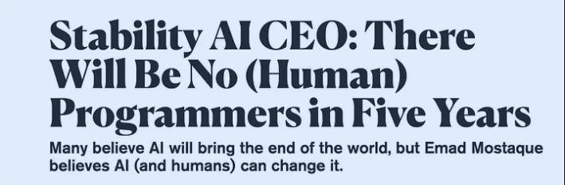

원문

- https://pchojecki.medium.com/there-will-be-no-programmers-in-5-years-f07cd78c69d5

스타빌리티 AI의 CEO, 에마드 모스타크의 대담한 예측은 5년 내에 인간 프로그래머가 없어질 것이라는 것으로, 기술 커뮤니티에서 상당한 논란과 토론을 일으켰습니다. 이러한 도발적인 주장은 인공지능(AI), 특히 생성 AI 시스템 분야에서의 빠른 발전을 바탕으로 합니다.
  

  

모스타크의 논리는 AI가 프로그래밍 영역에서 변혁적인 잠재력을 가지고 있다는 점에 초점을 맞추고 있습니다.
그는 깃허브(GitHub)에서 코드의 상당 부분(41%)이 AI에 의해 생성되었다고 언급하며, 코딩에서 AI의 영향력이 커지고 있음을 강조합니다. 이 주장은 AI가 많은 프로그래밍 작업을 자동화할 수 있는 미래를 시사하며, 이는 인간 프로그래머의 역할을 재정립할 가능성이 있음을 의미합니다.
  
모스타크의 논리는 AI가 프로그래밍 영역에서 변혁적인 잠재력을 가지고 있다는 점에 초점을 맞추고 있습니다. 그는 깃허브(GitHub)에서 코드의 상당 부분(41%)이 AI에 의해 생성되었다고 언급하며, 코딩에서 AI의 영향력이 커지고 있음을 강조합니다. 이 주장은 AI가 많은 프로그래밍 작업을 자동화할 수 있는 미래를 시사하며, 이는 인간 프로그래머의 역할을 재정립할 가능성이 있음을 의미합니다.
  
Mostaque가 이끄는 회사인 Stability AI는 언어 모델부터 이미지 생성, DNA분석까지 다양한 AI프로젝트에 적극적으로 참여하고 있습니다. 이러한 노력은 우리가 기술과 상호 작용하는 방식에 혁명을 일으킬 수 있는 포괄적인 AI인프라를 구축하는 것을 목표로 합니다. Mostaque는 AI를 인간의 능력을 대체하는 것이 아니라 강화하는 도구로 상상하며, AI와 인간이 협력하여 더 중요한 결과를 달성하는 미래를 제시합니다.
  
그러나 이러한 관점은 보편적으로 받아들여지지는 않습니다. 기술 커뮤니티의 다른 관점에서는 GitHub Copilot, Google의 Duet AI, JetBrains의 AI기반 IDE와 같은 AI 도구가 점점 더 널리 보급되고 있지만 인간 프로그래머를 완전히 대체할 수는 없을 것이라고 주장합니다. 인간 프로그래머는 현재 AI도구의 범위를 넘어서는 문제 해결, 창의성, 비반적 사고 및 도메인 전문 지식을 보유하고 있습니다. 따라서 프로그래머를 대체하기 보다는 AI가 그들을 보조하여 코드 품질을 향상시키고 작업 부하를 완화할 가능성이 더 높습니다.
  
요약하자면, AI가 프로그래밍 분야를 확실히 변화시키고 있지만, 가까운 미래에 AI가 인간 프로그래머를 완전히 대체한다는 아이디어는 여전히 논쟁의 주제로 남아 있습니다. 업계 전문가와 AI시스템 자체가 제안한 더 가능성 있는 시나리오는 AI도구가 인간 프로그래밍 노력을 완전히 대체하는 것이 아니라 지원하고 향상시키는 하이브리드 미래입니다.
